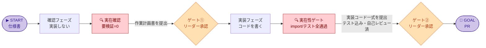
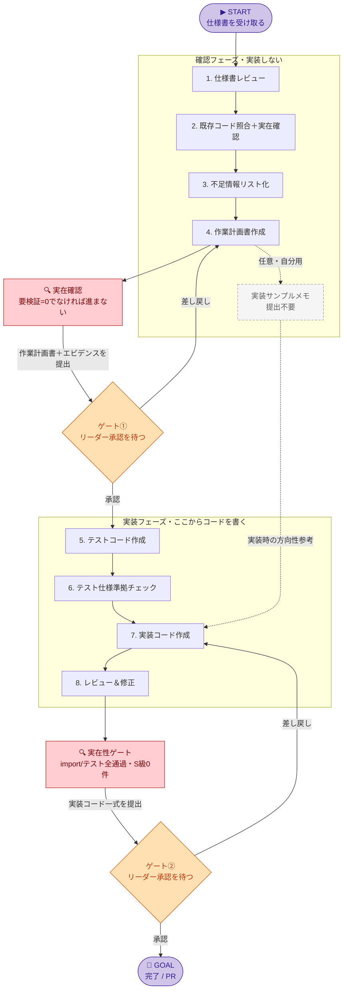

# Copilot 開発運用ガイド（メンバー用）

**あなた＝メンバー**。START（仕様書を受け取る）から GOAL（PR）まで進める。途中**2回、リーダーに提出して承認を待つ**（リーダー＝ゲート承認、クライアント＝仕様の確認/補正）。

## 3つの柱（鉄則）

このガイドは3つの柱で品質を守る。どれも各ゲートの通過条件になる。

1. **確認と実装を分ける** — 確認フェーズではプロダクションコードもテストコードも書かない（提出物は作業計画書）。実装は実装フェーズから。途中2回リーダーに提出して承認を待つ（2ゲート制）。
2. **テストファースト** — 実装フェーズはテスト作成(ステップ5)→実装(ステップ7)の順。実装はテストを満たす最小限。
3. **実在確認で幻覚を潰す** — Copilotは「ありそうな名前」を自信満々に提案する。挙げた関数 / API / ライブラリ / 設定キー / DBカラムは実物で裏取りする。AIに「ありますか？」と聞かず、検証コマンドを走らせて証跡（確認方法・結果・根拠）を出させる。→ 詳細は下の **§幻覚対策（実在確認）の詳細【柱③】**

> 補助の「実装サンプルメモ」は任意・自分用（リーダー提出不要）。実装作業ではなく方向性確認に留める。

## 全体フロー

> 図の見方: ▶STARTから🏁GOALへ / 白＝あなた（メンバー）の作業 / 橙＝リーダーに提出して承認を待つ / 🔍赤＝幻覚対策の実在確認（ここを通さないとゲートに出せない）

### ① 大局（まずこれで全体像）

### ② 詳細（各フェーズの中身と差し戻し）

## チェックリスト

### 確認フェーズ（実装しない）

- [ ] **1. 仕様書レビュー** … 矛盾・曖昧な語句・未定義条件・境界条件不足を抽出
- [ ] **2. 既存コード照合＋実在確認** … 実装可能性と既存設計との衝突箇所を確認。加えて、使う予定の関数 / API / ライブラリ / 設定キーを全部リスト化し、実物（grep・import・公式doc）で実在を裏取り（AIに聞き返して確認しない）
      - [ ] **【幻覚対策・必須】AI提案の実在確認** … Copilotの提案を実物で裏取りする（確認方法・結果・根拠をセットで作業計画書に添付）
            - [ ] 関数・型・クラスは `rg` / `grep` / IDE検索で確認した
            - [ ] ライブラリは dependency / lockファイル / import実行で確認した
            - [ ] 設定キーは config / env / CI / Secret 設定で確認した
            - [ ] DBカラムは migration / schema / ORM / 実DBで確認した
            - [ ] 外部APIは公式docまたは既存clientで確認した
            - [ ] 未確認（`[要検証]`）のものを既存前提で作業計画書に入れていない（残るうちは提出①に進まない）
- [ ] **3. 不足情報リスト化** … 足りない仕様 / データ / API / テスト観点＋それぞれの根拠
- [ ] **4. 作業計画書作成** … 方針 / 対象ファイル / 影響範囲 / テスト方針 / リスク / 確認事項 / コミット計画
      - 任意: 「実装サンプルメモ」を**自分用に**作成（**リーダー提出不要**）。作業に慣れるまで方向性を確認するためのサポート資料。新規・変更コードの重要箇所の抜粋（完成コード全文や既存コードの長文貼り付けはしない）
- [ ] **★ リーダーに提出①** … 作業計画書を承認（差し戻しなら 4 へ）
      - 通過条件: **実在確認エビデンス込み**で提出。`[要検証]` 残ゼロが前提（未確認の依存が残るなら提出しない）

### 実装フェーズ（ここからコードを書く）

- [ ] **5. テストコード作成** … 先にテストを書く（正常系 / 異常系 / 境界条件）
- [ ] **6. テスト仕様準拠チェック** … テストが仕様を正しく表現し、勝手な仕様追加がないか確認
- [ ] **7. 実装コード作成** … プロダクションコードはここから。テストを満たす最小実装
- [ ] **8. レビュー＆修正** … 致命度の高い順（実在性 / 仕様逸脱 / 既存挙動破壊 / セキュリティ / データ不整合 / パフォーマンス / 保守性）。実在性＝呼び出す関数 / 引数 / ライブラリ / 設定が実在しシグネチャが正しいか。import実行とテスト実行で機械的に確認
      - [ ] **【幻覚対策・必須】実在性ゲート** … import / test / 型チェックが実際に通る。存在しない関数 / 引数 / ライブラリ / 設定の呼び出し（＝S級）が**0件**になるまで提出②に進まない。モックは実在するインターフェースにだけ作る（モックで幻覚を隠さない）
- [ ] **★ リーダーに提出②** … 最終レビューを承認 → PR（差し戻しなら 7 へ）
      - 通過条件: **実在性ゲート通過**（import / テスト実行ログを添付）。落ちる import が1つでもあれば提出しない
      - ※差し戻し先は原則7だが、テスト不足→5・計画不備→4・仕様不足→1（またはクライアント確認）など、原因次第でリーダー指示に従い前工程へ戻る

## 幻覚対策（実在確認）の詳細【柱③】

各ゲートの前に実在確認を必ず通す。要点は1つ — **記憶で断定せず、実コマンドの出力で裏取りする**（実行は人間でもAIエージェントでもよい）。

| 関門 | やること | これを満たさないと進めない |
|---|---|---|
| **ステップ2 → ゲート①前** | 使う予定の外部依存を全リスト化し、実物で実在確認。確認方法・結果・根拠をセットで作業計画書に添付 | `[要検証]` が **0件** |
| **ステップ8 → ゲート②前** | import / test / 型チェックが実際に通る（実在性＝レビュー致命度の最上位） | 存在しない呼び出し（S級）が **0件** |

### 確認方法（種別ごと・実物で裏取り）

検証コマンドの実行はAIエージェントにやらせてよい（速くて確実）。**根拠はAIの説明でなく、実行した出力**。

- **関数・型・クラス**: `rg` / `grep` / IDE検索で既存コードを確認
- **import可能性**: `python -c "import xxx"` / `node -e "require('xxx')"` / `go list` などで確認
- **ライブラリ**: `package.json` / `pyproject.toml` / `go.mod` / lockファイルを確認
- **設定キー**: `.env.example` / configファイル / Secret Manager / CI設定を確認
- **DBカラム**: migration / schema / ORM定義 / 実DBの `\d`・`describe` で確認
- **外部API**: 公式ドキュメント、または既存のAPIクライアント実装を確認
- **挙動**: 最小テスト / dry-run / 型チェック / lint / unit test で確認

### 禁止

- AIに「この関数はありますか？」と聞いて確認したことにする
- AIの説明だけで既存要素として扱う
- grep / import 確認なしに作業計画書へ確定事項として書く
- モックで幻覚を隠す（実在するインターフェースにだけモックを作る）

### 出力形式（証跡を必ずセットで）

`確認しました。存在します。` はダメ。**確認方法・結果・根拠**を必ずセットで残す。

| 対象 | 種別 | 確認方法 | 結果 | 根拠 |
|---|---|---|---|---|
| calculateScore | 関数 | `rg "calculateScore" src/` | 既存あり | `src/domain/scoring.py` |
| pandas | ライブラリ | `python -c "import pandas"` | 依存あり | `pyproject.toml` |
| user.score | DBカラム | migration確認 | 未確認 | 該当migrationなし → `[要検証]` |

## ドキュメント早見

- **仕様書** … 何を満たすか
- **作業計画書** … どう進めるか（コードは原則書かない）【必須】
- **実装サンプルメモ** … 新規・変更コードの重要箇所の抜粋サンプル【任意・自分用／リーダーレビュー不要】

使い分け: 仕様書＋作業計画書が基本。実装サンプルメモは、作業に慣れるまで自分の方向性確認に使う自助資料（提出物ではない）

## プロンプト集

各ステップで Copilot に渡すプロンプト例 → [prompt-templates.md](prompt-templates.md)
