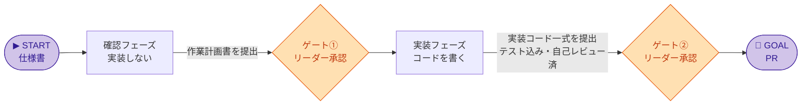
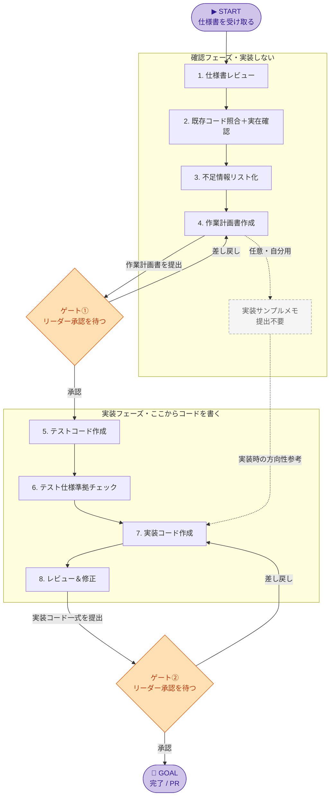

# Copilot 開発運用ガイド（メンバー用）

**あなた＝メンバー**。START（仕様書を受け取る）から GOAL（PR）まで進める。途中**2回、リーダーに提出して承認を待つ**（リーダー＝ゲート承認、クライアント＝仕様の確認/補正）。

## 4つの柱（鉄則）

このガイドは4つの柱で品質を守る。どれも各ゲートの通過条件になる。

1. **確認と実装を分ける** — 確認フェーズではプロダクションコードもテストコードも書かない（提出物は作業計画書）。実装は実装フェーズから。途中2回リーダーに提出して承認を待つ（2ゲート制）。
   - 作業計画書 ≒ Claude Code / Codex / Cursor の **plan mode**（実装前に方針だけ立てる読み取り専用モード）に相当。AI コーディング支援を使う場合は各エディタの plan mode で下書きして本ワークフローの作業計画書として整形してよい。
2. **テストファースト** — 実装フェーズはテスト作成(ステップ5)→実装(ステップ7)の順。実装はテストを満たす最小限。
3. **実在確認で幻覚を潰す** — Copilotは「ありそうな名前」を自信満々に提案する。挙げた関数 / API / ライブラリ / 設定キー / DBカラムは実物で裏取りする。AIに「ありますか？」と聞かず、検証コマンドを走らせて証跡（確認方法・結果・根拠）を出させる。→ 確認手順・禁止・出力形式は [02_prompt-templates.md](02_prompt-templates.md) の「実在確認」参照。
4. **ゴールと成功定義で人間間のズレを防ぐ** — 作業計画書の冒頭にタスクゴール・成功定義・リーダー・メンバー共通認識を置く。「何を作るか」をリーダーとメンバーが読んで「そうそう、それをやる」と言える水準まで言語化してからゲート①に臨む。ゴールが合わないまま実装に進んでも、技術的に正しいコードが「これじゃない」になる。→ テンプレートは [02_prompt-templates.md](02_prompt-templates.md) の「4-ゴール」参照。

> 補助の「実装サンプルメモ」は任意・自分用（リーダー提出不要）。実装作業ではなく方向性確認に留める。

## 全体フロー

> 図の見方: ▶STARTから🏁GOALへ / 白＝あなた（メンバー）の作業 / 橙＝リーダーに提出して承認を待つ

### ① 大局（まずこれで全体像）

### ② 詳細（各フェーズの中身と差し戻し）

## チェックリスト

### 着手前確認（START 前）

- [ ] **依頼のトレーサビリティ** … 仕様書にイシューリンクまたは Teams チャット履歴リンクがある。誰からの依頼か・背景が後から追跡できる状態か確認する。なければリーダーまたはクライアントに追記を依頼してから着手する
- [ ] **対象リポジトリとブランチ** … 作業するリポジトリが明確か。どのブランチから切る（base）か、どのブランチにマージする（target）かが確認済みか。未確定ならリーダーに確認してから着手する
- [ ] **README の実行・検証方法** … 対象リポジトリの README に実行方法と動作検証方法が記載されているか。未記載の場合はステップ3（不足情報リスト化）で不足事項として挙げる

### 確認フェーズ（実装しない）

- [ ] **1. 仕様書レビュー** … 矛盾・曖昧な語句・未定義条件・境界条件不足を抽出
- [ ] **2. 既存コード照合＋実在確認** … 実装可能性と既存設計との衝突を確認。使う予定の関数 / API / ライブラリ / 設定キー / DBカラムを実物（grep・import・lock/schema・公式doc）で裏取りし、確認方法・結果・根拠をセットで計画書に添付
      - [ ] **【幻覚対策・必須】** `[要検証]` を確定事項として扱わない。残る場合は、確認不能な理由・確認先・作業への影響を作業計画書に明記する（手順は 02_prompt-templates.md「実在確認」）
- [ ] **3. 不足情報リスト化** … 足りない仕様 / データ / API / テスト観点＋それぞれの根拠
- [ ] **4. 作業計画書作成** … タスク種別 / タスクゴール / 成功定義 / リーダー・メンバー共通認識 / 実装方針 / 対象ファイル / 影響範囲 / テスト方針 / リスク / 確認事項 / コミット計画
      - 成功定義の確認方法はタスク種別で選ぶ: Pythonバッチ＝pytest（正常系/異常系/境界値）＋作成物確認（出力ファイル/DB/集計値の内容まで確認。ログ確認だけでは不十分）/ Terraform＝validate・plan差分確認＋apply後リソース確認（テストコードは書かない）
      - 任意: 「実装サンプルメモ」を**自分用に**作成（**リーダー提出不要**）。作業に慣れるまで方向性を確認するためのサポート資料。新規・変更コードの重要箇所の抜粋（完成コード全文や既存コードの長文貼り付けはしない）
- [ ] **★ リーダーに提出①** … 作業計画書を承認（差し戻しなら 4 へ）
      - ゴール・成功定義・共通認識の3項目が記入され、リーダーが読んで合意できる内容か確認する（合意できなければ差し戻し）

### 実装フェーズ（ここからコードを書く）

- [ ] **5. テストコード作成** … 先にテストを書く（正常系 / 異常系 / 境界条件）
- [ ] **6. テスト仕様準拠チェック** … テストが仕様を正しく表現し、勝手な仕様追加がないか確認
- [ ] **7. 実装コード作成** … プロダクションコードはここから。テストを満たす最小実装
- [ ] **8. レビュー＆修正** … 致命度の高い順（実在性 / 仕様逸脱 / 既存挙動破壊 / セキュリティ / データ不整合 / パフォーマンス / 保守性）。実在性＝import / test / 型チェックが実際に通り、存在しない呼び出し（S級）が0件。満たすまで提出②に出さない
- [ ] **★ リーダーに提出②** … 最終レビューを承認 → PR（差し戻しなら 7 へ）
      - ※差し戻し先は原則7だが、テスト不足→5・計画不備→4・仕様不足→1（またはクライアント確認）など、原因次第でリーダー指示に従い前工程へ戻る

## ドキュメント早見

- **仕様書** … 何を満たすか
- **作業計画書** … どう進めるか（コードは原則書かない／Claude Code・Codex・Cursor の plan mode 相当）【必須】
- **実装サンプルメモ** … 新規・変更コードの重要箇所の抜粋サンプル【任意・自分用／リーダーレビュー不要】

使い分け: 仕様書＋作業計画書が基本。実装サンプルメモは、作業に慣れるまで自分の方向性確認に使う自助資料（提出物ではない）

## プロンプト集

各ステップで Copilot に渡すプロンプト例 → [02_prompt-templates.md](02_prompt-templates.md)
